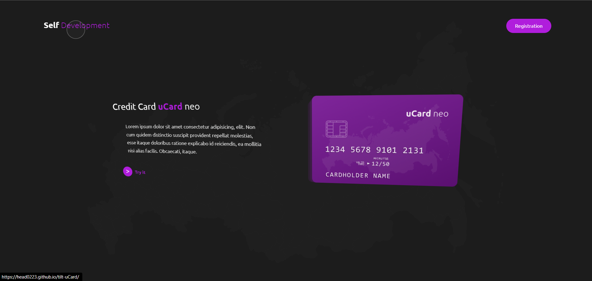
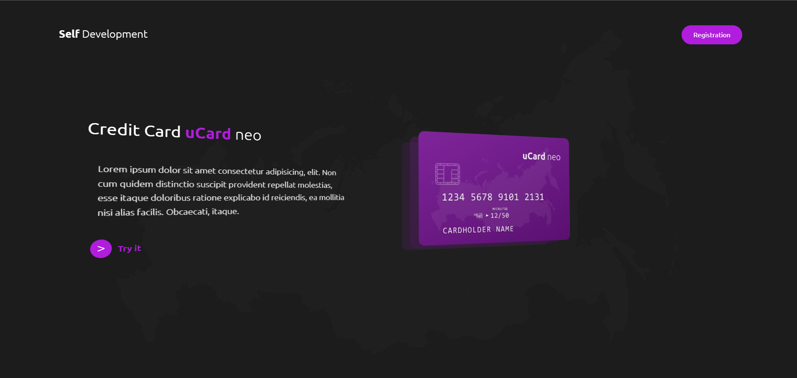

# uCard 3DTilt Project


[](https://head0223.github.io/tilt-uCard/)

Experience the enchanting world of uCard 3DTilt website featuring a captivating credit card design that can be tilted in every direction. Crafted with meticulous detail using three layers, the result is a visually stunning and immersive effect.

## Table of Contents

-  [Folder Structure](#folder-structure)
-  [Usage](#usage)
-  [Media](#Media)
-  [Contributing](#contributing)
-  [Dependencies](#dependencies)

## Folder Structure

-  **css:** Contains the styles for the website.
-  **fonts:** Contains font files utilized in the project.
-  **img:** Holds all the images used in the project.
-  **js:** Includes the JavaScript file for additional functionality.
-  **libs:** Contains external libraries for enhanced features.

## Usage

1. Clone the repository:

```bash
git clone https://github.com/HEAD0223/tilt-uCard.git
cd tilt-uCard
```

2. Open the index.html file in a web browser to view the website.

## Media





## Contributing

If you would like to contribute to this project, please follow these steps:

1. Fork the repository.
2. Create a new branch for your feature: `git checkout -b feature-name`
3. Commit your changes: `git commit -m 'Add some feature'`
4. Push to the branch: `git push origin feature-name`
5. Submit a pull request.

## Dependencies

-  **GSAP:** GreenSock Animation Platform for smooth and performant animations.
-  **Bootstrap:** A popular CSS framework for building responsive and mobile-first websites.

Make sure to include these dependencies in your project.
